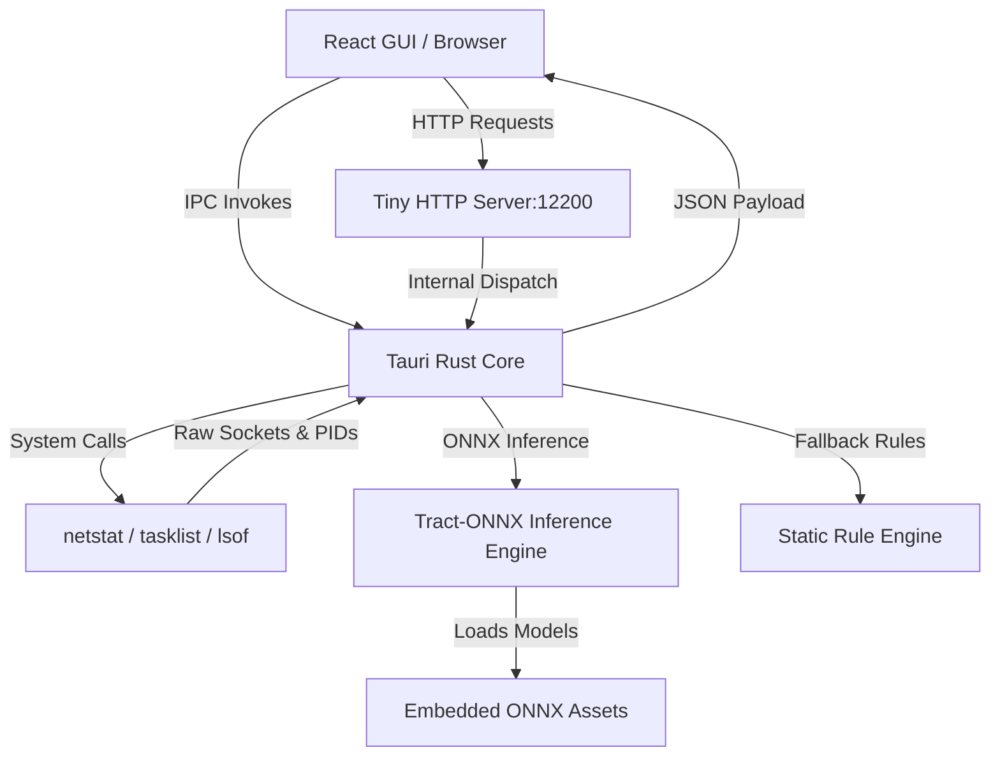

# 🔍 PortIntel

<div align="center">

[](https://tauri.app/)
[](https://react.dev/)
[](https://www.rust-lang.org/)
[](https://onnx.ai/)
[](https://www.typescriptlang.org/)
[](https://tailwindcss.com/)

**An offline-first, cross-platform port intelligence tool & safe process termination supervisor.**

[Features](#-key-features) • [Architecture](#-architecture) • [Getting Started](#%EF%B8%8F-getting-started) • [ML Classifier](#%EF%B8%8F-machine-learning-classifier) • [API Documentation](#-api-endpoints) • [Safety Policy](#-system-safety--protection-override)

</div>

---

## 🌟 Overview

**PortIntel** is a lightweight desktop utility designed for developers, system administrators, and security analysts to inspect active TCP and UDP port bindings on their system. 

Unlike generic port scanners, **PortIntel** embeds an offline-first **Decision Tree Machine Learning classifier** that evaluates process properties (such as port number, privilege level, process category, and operating system) to determine:
1. **Importance Category**: Whether a port is running system-critical, development-related, or suspicious/unknown workloads.
2. **Termination Safety**: Whether a port can be safely shut down to free up socket resources or if doing so could destabilize the workstation.

---

## ✨ Key Features

- **🔍 Comprehensive Socket Scanning**: Real-time detection of active ports on Windows (via `netstat`) and macOS/Linux (via `lsof`).
- **🧠 Embedded ML Inference**: Offline inference using ONNX models via Rust's `tract-onnx` framework. No cloud API keys or internet connection required.
- **🛡️ Safety Protection Engine**: Hard overrides that prevent users from accidentally terminating core OS processes (like RPC, spoolers, Bonjour, or system resolvers) to avoid freezes, crashes, or Blue Screens (BSOD).
- **📋 Offline Diagnostic Advisor**: A detail-rich inspector panel detailing socket context, process category, security assessment, and OS command alternatives to safely stop bindings.
- **📂 Project-Centric Grouping**: Ports automatically categorized into logical collections—Web Development Servers, Databases, Docker containers, System Daemons, and Utilities.
- **📡 Background HTTP Server Engine**: Runs an lightweight Tiny HTTP service on port `12200` to feed external browser extensions, terminal CLI clients, or custom dashboards.

---

## 📐 Architecture

PortIntel is built with a decoupled React frontend and Tauri + Rust backend:



---

## ⚙️ Tech Stack

- **Frontend**: React (v18), TypeScript, Vite, Tailwind CSS, Lucide Icons
- **Backend Wrapper**: Tauri (v2), Rust
- **ML Inference**: `tract-onnx` (compiled directly into the Rust executable)
- **Model Training**: Python (v3.10+), NumPy, Scikit-Learn, `skl2onnx`
- **HTTP Daemon**: `tiny_http`, `serde_json`, `serde`

---

## 🚀 Getting Started

### 📋 Prerequisites

Ensure you have the following installed on your developer machine:
- **Node.js** (v18 or higher) & **npm**
- **Rust Toolchain** (via `rustup`)
- **Python 3.10+** (only required if retrain/regenerate models is needed)

---

### 🛠️ Installation & Setup

1. **Clone the Repository**
   ```bash
   git clone https://github.com/Laksopan23/PortIntel.git
   cd PortIntel
   ```

2. **Install Node Dependencies**
   ```bash
   npm install
   ```

3. **Train the ML Models (Optional)**
   The models are pre-trained and saved in `src-tauri/assets/`. If you want to customize features or update training mappings, install python requirements and execute:
   ```bash
   pip install numpy scikit-learn skl2onnx
   python train_model.py
   ```
   This will output updated `port_classifier_importance.onnx` and `port_classifier_safety.onnx` models directly into `src-tauri/assets/`.

4. **Launch Development Server**
   ```bash
   npm run tauri dev
   ```

5. **Build Native Executables**
   To package PortIntel as a production installer/executable for your operating system:
   ```bash
   npm run tauri build
   ```

---

## 🛡️ System Safety & Protection Override

To guarantee workstation stability, PortIntel implements a dual-layer safety mechanism:

1. **Classification Safe-Guards**: The Machine Learning safety classifier alerts users about `DANGEROUS_TO_KILL` processes.
2. **Hard-coded Kernel Overrides**: The Tauri process killer specifically checks process criteria and disables the "Kill" action for:
   - System PIDs (typically $\le 100$).
   - Core executables (`svchost.exe`, `lsass.exe`, `wininit.exe`, `services.exe`, `smss.exe`, `csrss.exe`, `winlogon.exe`, `spoolsv.exe`, `launchd`, `init`).
   - Sockets registered under system/root users or standard system namespaces.

Instead of force-killing, the UI disables the action and prompts the user with alternative, safe termination pathways (such as gracefully stopping service daemons or pausing Docker containers).

---

## 🧠 Machine Learning Classifier

PortIntel uses an offline **Decision Tree Classifier** model trained using `scikit-learn` and exported to `.onnx`.

### Feature Vector Structure
For each active socket, a 4-dimensional feature vector is generated:
$$\vec{x} = \begin{bmatrix} \text{Port Number} \\ \text{Is System User } (0/1) \\ \text{Process Category Index } (0 \text{--} 18) \\ \text{Operating System } (0 = \text{macOS/Linux}, 1 = \text{Windows}) \end{bmatrix}$$

### Output Vectors
1. **Importance Classification**:
   - `0` $\rightarrow$ **CRITICAL** (e.g., system services)
   - `1` $\rightarrow$ **DEVELOPMENT** (e.g., Node/Vite dev servers, local databases)
   - `2` $\rightarrow$ **UNKNOWN/SUSPICIOUS** (unidentified non-standard bindings)
2. **Termination Safety**:
   - `0` $\rightarrow$ **SAFE\_TO\_KILL**
   - `1` $\rightarrow$ **DANGEROUS\_TO\_KILL**

---

## 📡 API Endpoints

When the Tauri app is active, it spins up a background HTTP server at `http://127.0.0.1:12200` to serve external integrations.

### 1. Retrieve Active Ports
* **Endpoint**: `GET /ports` or `GET /active-ports`
* **Response**: `200 OK`
  ```json
  [
    {
      "port": 3000,
      "pid": 14201,
      "process_name": "node",
      "protocol": "TCP",
      "user": "dev_user"
    }
  ]
  ```

### 2. Kill Sockets/Process
* **Endpoint**: `POST /kill` or `POST /kill-process`
* **Payload**:
  ```json
  { "pid": 14201 }
  ```
* **Response**: `200 OK` on success, `500 Internal Server Error` if access is denied.

### 3. Analyze Socket
* **Endpoint**: `POST /analyze` or `POST /analyze-port`
* **Payload**:
  ```json
  {
    "port": 3000,
    "processName": "node",
    "isSystem": false
  }
  ```
* **Response**: `200 OK`
  ```json
  {
    "category": "Dev Server",
    "importance": "DEVELOPMENT",
    "safety": "SAFE_TO_KILL",
    "reasoning": "User development environment or application server. Safe to terminate to free up port resources."
  }
  ```

